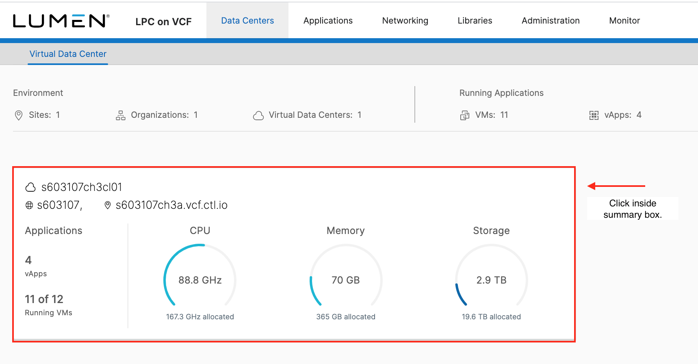
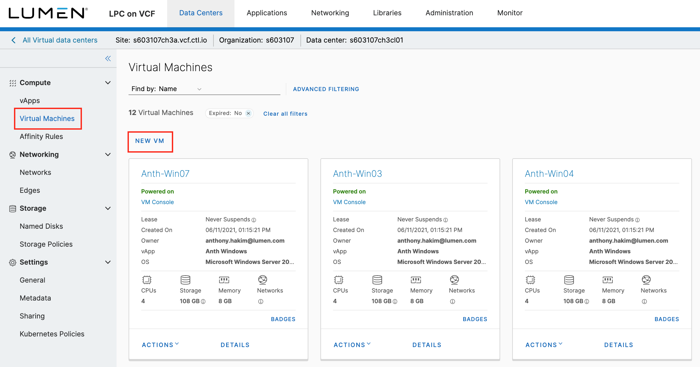
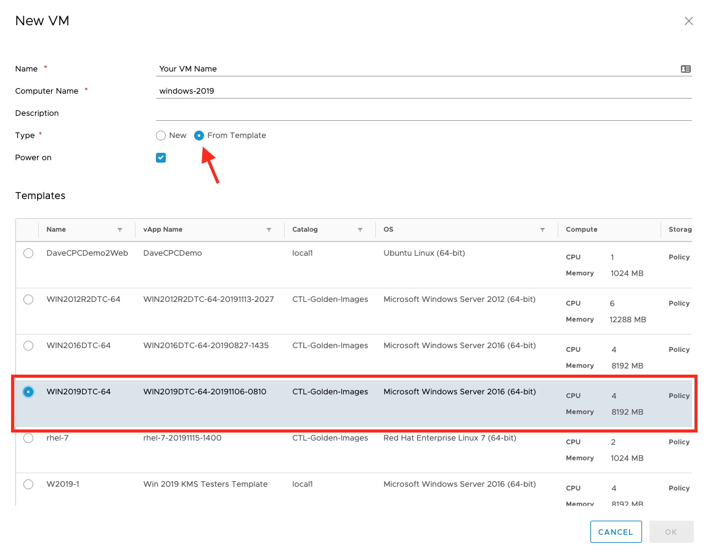
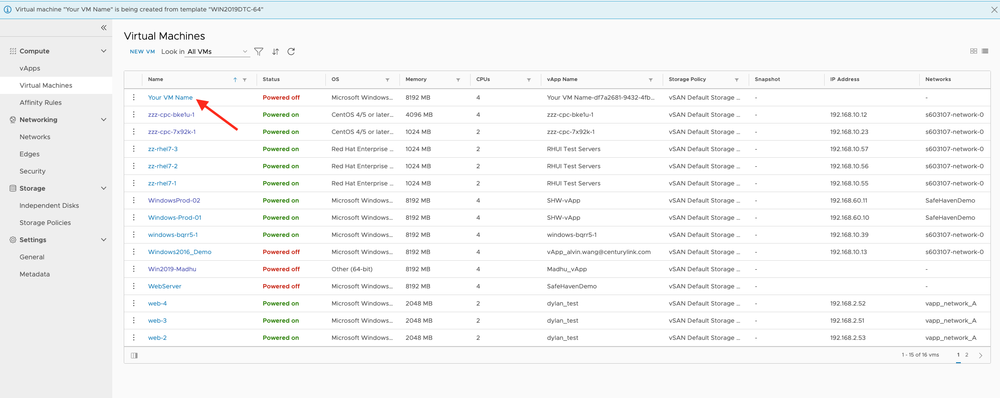

{{{
  "title": "Windows 2019",
  "date": "6-23-21",
  "author": "John Grant",
  "keywords": ["lpc", "cloud", "vm", "windows2019", "vcloud", "vcf"],
  "attachments": [],
  "related-products" : [],
  "contentIsHTML": false,
  "sticky": false
}}}

### Description
In this KB article, we walk through creating a Virtual Machine (VM) with Windows 2019 OS in Lumen Private Cloud on VMware Cloud Foundation (LPC on VCF).

### Steps

1. Log In to your LPC on VCF environment.

2. Click the Virtual Data Center summary box.

3. Click __Virtual Machines__ under Compute in the sidebar on the left side of the screen.

4. Click __New VM__.

5. Enter Name, Computer Name, and Description (optional). Select From Template as the Type. Choose whether or not the VM should be powered on after creation.

6. In the Template options select the template with the name __WIN2019DTC-64__. Although the OS for this template shows __Microsoft Windows Server 2016 (64-bit)__, this is the Windows 2019 OS. This is a VMware known issue.

7. Click __OK__.

8. Your VM will then appear at the top of the list on the Virtual Machines page.

